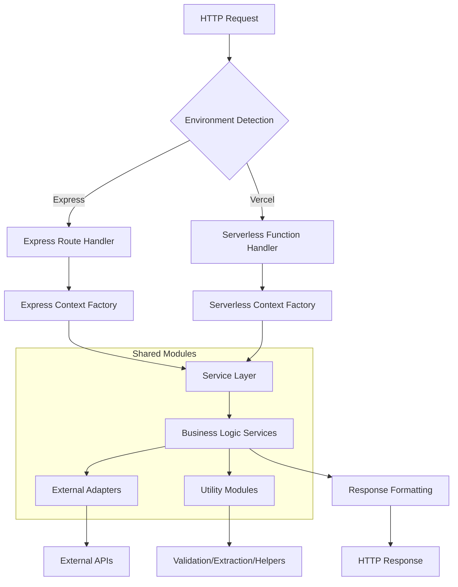

# 🏗️ Express.js Server Refactoring Architecture Plan

## Executive Summary

This plan transforms the 1,399-line monolithic [`server/index.js`](../../server/index.js) into a well-organized, modular architecture that supports both Express.js (local development) and Vercel serverless functions (production) through shared business logic modules.

## 📊 Current State Analysis

### Monolithic Structure Issues
- **Single file**: 1,399 lines mixing concerns
- **Code duplication**: Logic repeated between [`server/index.js`](../../server/index.js) and [`api/`](../../api/) functions
- **Tight coupling**: Middleware, business logic, and routing intertwined
- **Testing challenges**: Difficult to unit test individual components
- **Maintenance burden**: Changes require understanding entire codebase

### Existing Functionality Inventory
- **8 API endpoints**: translate, scrape, session management (store/verify/clear), health
- **Middleware stack**: CORS, session, validation, timeout, logging
- **Encryption utilities**: AES-256-CBC for API key management
- **Web scraping engine**: Encoding detection, content extraction (69shuba specialized)
- **DeepSeek integration**: OpenAI SDK with model selection
- **Session management**: Server-side encrypted storage

## 🎯 Architectural Goals

1. **Shared Business Logic**: Common modules used by both Express and Vercel
2. **Single Responsibility**: Each module handles one concern
3. **Dependency Injection**: Configurable dependencies for different environments
4. **Environment Agnostic**: Code works in both server and serverless contexts
5. **Maintainability**: Clear separation of concerns and testability
6. **Backward Compatibility**: Preserve all existing functionality

## 📁 Proposed File Structure

```
website/
├── server/                          # Express.js server
│   ├── index.js                     # Main Express app
│   └── routes/                      # Express route handlers
│       ├── translate.js
│       ├── scrape.js
│       ├── session.js
│       └── health.js
├── api/                             # Vercel serverless functions
│   ├── translate.js                 # Translation endpoint
│   ├── scrape.js                    # Scraping endpoint
│   ├── health.js                    # Health check endpoint
│   └── session/                     # Session management endpoints
│       ├── store-key.js
│       ├── verify-key.js
│       └── clear-key.js
├── lib/                             # Shared business logic
│   ├── services/                    # Core business services
│   │   ├── translationService.js
│   │   ├── scrapingService.js
│   │   ├── sessionService.js
│   │   └── encryptionService.js
│   ├── adapters/                    # External service adapters
│   │   ├── deepseekAdapter.js
│   │   └── webScraperAdapter.js
│   └── context/                     # Environment context factories
│       ├── expressContext.js
│       └── serverlessContext.js
├── config/                          # Configuration management
│   ├── index.js                     # Config loader
│   └── environments/                # Environment-specific configs
│       ├── development.js
│       ├── production.js
│       └── serverless.js
├── middleware/                      # Express middleware factories
│   ├── cors.js
│   ├── session.js
│   ├── validation.js
│   ├── logging.js
│   ├── timeout.js
│   └── errorHandler.js
├── utils/                           # Utility modules
│   ├── validators/                  # Input validation
│   │   ├── translationValidator.js
│   │   ├── urlValidator.js
│   │   └── apiKeyValidator.js
│   ├── extractors/                  # Content extraction
│   │   ├── contentExtractor.js
│   │   ├── encodingDetector.js
│   │   └── titleExtractor.js
│   └── helpers/                     # Helper functions
│       ├── responseHelper.js
│       ├── cookieHelper.js
│       └── retryHelper.js
├── types/                           # Type definitions and interfaces
│   ├── api.js
│   ├── config.js
│   └── errors.js
└── tests/                           # Test suites
    ├── unit/
    ├── integration/
    └── e2e/
```

## 🔧 Detailed Module Specifications

### 1. **Core Services** (`lib/services/`)

#### `translationService.js`
Handles all translation business logic with dependency injection for different environments.

```javascript
class TranslationService {
  constructor(deepseekAdapter, sessionService, config) {
    this.deepseekAdapter = deepseekAdapter;
    this.sessionService = sessionService;
    this.config = config;
  }
  
  async translate(request, sessionContext) {
    // Validate request
    const validation = this.validateRequest(request);
    if (!validation.valid) {
      throw new ValidationError(validation.error, validation.message);
    }
    
    // Get API key from session
    const apiKey = await this.sessionService.getApiKey('deepseek', sessionContext);
    if (!apiKey) {
      throw new AuthenticationError('No API key provided');
    }
    
    // Select and validate model
    const selectedModel = this.selectModel(request.model);
    
    // Perform translation
    const result = await this.deepseekAdapter.createCompletion(apiKey, {
      model: selectedModel,
      messages: this.buildMessages(request.text, request.from, request.to),
      temperature: 1.3,
      max_tokens: this.getMaxTokens(selectedModel)
    });
    
    return this.formatResponse(result, request);
  }
  
  validateRequest(request) {
    // Input validation logic
  }
  
  selectModel(requestedModel) {
    // Model selection and fallback logic
  }
  
  buildMessages(text, from, to) {
    // System prompt and message construction
  }
}
```

#### `scrapingService.js`
Handles web scraping business logic with specialized content extraction.

```javascript
class ScrapingService {
  constructor(webScraperAdapter, contentExtractor, encodingDetector, config) {
    this.webScraperAdapter = webScraperAdapter;
    this.contentExtractor = contentExtractor;
    this.encodingDetector = encodingDetector;
    this.config = config;
  }
  
  async scrapeUrl(url) {
    // Validate URL
    const validation = this.validateUrl(url);
    if (!validation.valid) {
      throw new ValidationError(validation.error, validation.message);
    }
    
    // Fetch content with retry logic
    const response = await this.webScraperAdapter.fetchUrl(validation.url);
    
    // Detect encoding
    const encoding = this.encodingDetector.detect(response, url);
    
    // Extract content
    const extractedData = this.contentExtractor.extract(response.data, url, encoding);
    
    // Validate content quality
    this.validateContent(extractedData, url);
    
    return extractedData;
  }
  
  validateUrl(url) {
    // URL validation logic
  }
  
  validateContent(extractedData, url) {
    // Content quality validation (especially for 69shuba)
  }
}
```

#### `sessionService.js`
Handles session and API key management across different environments.

```javascript
class SessionService {
  constructor(encryptionService, environment) {
    this.encryptionService = encryptionService;
    this.environment = environment;
  }
  
  async storeApiKey(keyName, keyValue, context) {
    // Validate API key format
    this.validateApiKey(keyName, keyValue);
    
    // Encrypt API key
    const encryptedKey = this.encryptionService.encrypt(keyValue);
    
    // Store based on environment (session vs cookie)
    if (this.environment.storage === 'session') {
      return this.storeInSession(keyName, encryptedKey, context);
    } else {
      return this.storeInCookie(keyName, encryptedKey, context);
    }
  }
  
  async getApiKey(keyName, context) {
    // Retrieve encrypted key
    const encryptedKey = this.environment.storage === 'session' 
      ? this.getFromSession(keyName, context)
      : this.getFromCookie(keyName, context);
    
    if (!encryptedKey) return null;
    
    // Decrypt and return
    return this.encryptionService.decrypt(encryptedKey);
  }
  
  async clearApiKey(keyName, context) {
    // Clear key from storage
  }
}
```

#### `encryptionService.js`
Handles encryption/decryption operations with AES-256-CBC.

```javascript
class EncryptionService {
  constructor(config) {
    this.algorithm = config.algorithm || 'aes-256-cbc';
    this.key = this.getEncryptionKey(config);
  }
  
  encrypt(data) {
    const iv = crypto.randomBytes(16);
    const cipher = crypto.createCipheriv(this.algorithm, this.key, iv);
    
    let encrypted = cipher.update(data, 'utf8', 'hex');
    encrypted += cipher.final('hex');
    
    return {
      encrypted,
      iv: iv.toString('hex')
    };
  }
  
  decrypt(encryptedData) {
    const { encrypted, iv } = encryptedData;
    const ivBuffer = Buffer.from(iv, 'hex');
    const decipher = crypto.createDecipheriv(this.algorithm, this.key, ivBuffer);
    
    let decrypted = decipher.update(encrypted, 'hex', 'utf8');
    decrypted += decipher.final('utf8');
    
    return decrypted;
  }
  
  getEncryptionKey(config) {
    // Environment-specific key generation
  }
}
```

### 2. **Adapters** (`lib/adapters/`)

#### `deepseekAdapter.js`
Handles DeepSeek API communication with OpenAI SDK.

```javascript
class DeepSeekAdapter {
  constructor(config) {
    this.baseURL = config.baseURL || 'https://api.deepseek.com';
    this.defaultModel = config.defaultModel || 'deepseek-chat';
  }
  
  async createCompletion(apiKey, request) {
    const client = this.createClient(apiKey);
    
    try {
      const completion = await client.chat.completions.create(request);
      return this.processResponse(completion);
    } catch (error) {
      throw this.handleError(error);
    }
  }
  
  createClient(apiKey) {
    return new OpenAI({
      baseURL: this.baseURL,
      apiKey: apiKey
    });
  }
  
  processResponse(completion) {
    // Response processing and validation
  }
  
  handleError(error) {
    // Error mapping and handling
  }
}
```

#### `webScraperAdapter.js`
Handles HTTP requests and response processing with retry logic.

```javascript
class WebScraperAdapter {
  constructor(config) {
    this.timeout = config.timeout || 45000;
    this.maxRetries = config.maxRetries || 3;
    this.retryDelay = config.retryDelay || 2000;
  }
  
  async fetchUrl(url, options = {}) {
    const axiosConfig = {
      timeout: this.timeout,
      responseType: 'arraybuffer',
      headers: {
        'User-Agent': 'Mozilla/5.0 (Windows NT 10.0; Win64; x64) AppleWebKit/537.36',
        'Accept': 'text/html,*/*',
        'Accept-Language': 'zh-CN,en'
      },
      maxRedirects: 10,
      validateStatus: (status) => status >= 200 && status < 400,
      ...options
    };
    
    return this.retryRequest(url, axiosConfig);
  }
  
  async retryRequest(url, config) {
    let lastError;
    
    for (let attempt = 1; attempt <= this.maxRetries; attempt++) {
      try {
        if (attempt > 1) {
          await this.delay(this.retryDelay * attempt);
        }
        
        const response = await axios.get(url, config);
        return this.processResponse(response, url);
      } catch (error) {
        lastError = error;
        
        // Don't retry certain errors
        if (error.response?.status === 404 || error.response?.status === 403) {
          throw error;
        }
        
        if (attempt === this.maxRetries) {
          throw error;
        }
      }
    }
  }
  
  processResponse(response, url) {
    // Response processing logic
  }
  
  delay(ms) {
    return new Promise(resolve => setTimeout(resolve, ms));
  }
}
```

### 3. **Configuration Management** (`config/`)

#### `index.js`
Configuration loader that detects environment and loads appropriate config.

```javascript
const path = require('path');

function loadConfig() {
  const environment = process.env.NODE_ENV || 'development';
  const isServerless = process.env.VERCEL || process.env.AWS_LAMBDA_FUNCTION_NAME;
  
  let configName;
  if (isServerless) {
    configName = 'serverless';
  } else {
    configName = environment;
  }
  
  try {
    const config = require(`./environments/${configName}`);
    return {
      ...config,
      environment: configName,
      isServerless
    };
  } catch (error) {
    console.warn(`Config file not found: ${configName}, falling back to development`);
    return require('./environments/development');
  }
}

module.exports = loadConfig();
```

#### `environments/development.js`
Development environment configuration.

```javascript
module.exports = {
  cors: {
    origins: true, // Allow all origins in development
    credentials: true
  },
  session: {
    secret: process.env.SESSION_SECRET || 'dev-secret-key',
    storage: 'session',
    cookie: {
      secure: false,
      httpOnly: true,
      maxAge: 3600000, // 1 hour
      sameSite: 'lax'
    }
  },
  encryption: {
    algorithm: 'aes-256-cbc',
    key: process.env.ENCRYPTION_KEY
  },
  deepseek: {
    baseURL: 'https://api.deepseek.com',
    defaultModel: 'deepseek-chat',
    maxTokens: {
      'deepseek-chat': 4096,
      'deepseek-reasoner': 8192
    }
  },
  scraping: {
    timeout: 45000,
    maxRetries: 3,
    retryDelay: 2000
  },
  logging: {
    level: 'debug',
    requests: true
  }
};
```

#### `environments/serverless.js`
Serverless environment configuration.

```javascript
module.exports = {
  cors: {
    origins: process.env.CORS_ORIGINS ? process.env.CORS_ORIGINS.split(',') : ['*'],
    credentials: true
  },
  session: {
    storage: 'cookie', // Use cookies for serverless
    encryption: true
  },
  encryption: {
    algorithm: 'aes-256-cbc',
    key: process.env.ENCRYPTION_KEY || 'translation-app-encryption-key-v1'
  },
  deepseek: {
    baseURL: 'https://api.deepseek.com',
    defaultModel: 'deepseek-chat',
    maxTokens: {
      'deepseek-chat': 4096,
      'deepseek-reasoner': 8192
    }
  },
  scraping: {
    timeout: 30000, // Shorter timeout for serverless
    maxRetries: 2,
    retryDelay: 1000
  },
  logging: {
    level: 'info',
    requests: false
  }
};
```

### 4. **Middleware Factories** (`middleware/`)

#### `cors.js`
Environment-aware CORS configuration.

```javascript
const cors = require('cors');

function createCorsMiddleware(config) {
  return cors({
    origin: config.cors.origins,
    credentials: config.cors.credentials,
    methods: ['GET', 'POST', 'PUT', 'DELETE', 'OPTIONS'],
    allowedHeaders: ['Content-Type', 'Authorization', 'X-Requested-With', 'Accept', 'Origin'],
    optionsSuccessStatus: 200
  });
}

module.exports = { createCorsMiddleware };
```

#### `session.js`
Session configuration factory.

```javascript
const session = require('express-session');
const crypto = require('crypto');

function createSessionMiddleware(config) {
  return session({
    secret: config.session.secret || crypto.randomBytes(64).toString('hex'),
    name: 'translation-session',
    resave: false,
    saveUninitialized: false,
    cookie: config.session.cookie,
    store: config.session.store
  });
}

module.exports = { createSessionMiddleware };
```

#### `validation.js`
Request validation middleware factory.

```javascript
function createValidationMiddleware(validator) {
  return (req, res, next) => {
    try {
      const result = validator.validate(req);
      if (!result.valid) {
        return res.status(400).json({
          error: result.error,
          message: result.message
        });
      }
      next();
    } catch (error) {
      next(error);
    }
  };
}

module.exports = { createValidationMiddleware };
```

### 5. **Context Factories** (`lib/context/`)

#### `expressContext.js`
Creates context for Express.js environment.

```javascript
const { TranslationService } = require('../services/translationService');
const { ScrapingService } = require('../services/scrapingService');
const { SessionService } = require('../services/sessionService');
const { EncryptionService } = require('../services/encryptionService');
const { DeepSeekAdapter } = require('../adapters/deepseekAdapter');
const { WebScraperAdapter } = require('../adapters/webScraperAdapter');

function createExpressContext(config) {
  // Create core services
  const encryptionService = new EncryptionService(config.encryption);
  const sessionService = new SessionService(encryptionService, config.session);
  const deepseekAdapter = new DeepSeekAdapter(config.deepseek);
  const webScraperAdapter = new WebScraperAdapter(config.scraping);
  
  // Create business services
  const translationService = new TranslationService(deepseekAdapter, sessionService, config);
  const scrapingService = new ScrapingService(webScraperAdapter, contentExtractor, encodingDetector, config);
  
  return {
    services: {
      translation: translationService,
      scraping: scrapingService,
      session: sessionService,
      encryption: encryptionService
    },
    adapters: {
      deepseek: deepseekAdapter,
      webScraper: webScraperAdapter
    },
    config
  };
}

module.exports = { createExpressContext };
```

#### `serverlessContext.js`
Creates context for serverless environment.

```javascript
function createServerlessContext(req, res) {
  const config = require('../../config');
  
  // Create services with serverless-specific configuration
  const context = createExpressContext(config);
  
  // Add serverless-specific helpers
  context.session = {
    get: (key) => getCookieValue(req, key),
    set: (key, value) => setCookieValue(res, key, value, config),
    clear: (key) => clearCookie(res, key)
  };
  
  context.errorHandler = {
    handle: (error, response) => handleServerlessError(error, response, config)
  };
  
  return context;
}

module.exports = { createServerlessContext };
```

## 🔄 Dependencies and Data Flow



## ⚙️ Error Handling Strategy

### Centralized Error Handling
```javascript
// middleware/errorHandler.js
class ErrorHandler {
  constructor(config) {
    this.isDevelopment = config.environment === 'development';
    this.isServerless = config.isServerless;
  }
  
  handle(error, req, res, next) {
    const statusCode = this.getStatusCode(error);
    const response = this.formatError(error);
    
    // Log error
    console.error(`[${new Date().toISOString()}] ${error.name}: ${error.message}`);
    if (this.isDevelopment) {
      console.error(error.stack);
    }
    
    res.status(statusCode).json(response);
  }
  
  getStatusCode(error) {
    if (error.name === 'ValidationError') return 400;
    if (error.name === 'AuthenticationError') return 401;
    if (error.name === 'TranslationError') return 500;
    if (error.name === 'ScrapingError') return 422;
    return 500;
  }
  
  formatError(error) {
    const response = {
      error: error.name || 'Internal Server Error',
      message: error.message || 'An unexpected error occurred'
    };
    
    if (this.isDevelopment) {
      response.stack = error.stack;
      response.details = error.details;
    }
    
    return response;
  }
}
```

### Custom Error Types
```javascript
// types/errors.js
class ValidationError extends Error {
  constructor(message, field) {
    super(message);
    this.name = 'ValidationError';
    this.field = field;
  }
}

class AuthenticationError extends Error {
  constructor(message) {
    super(message);
    this.name = 'AuthenticationError';
  }
}

class TranslationError extends Error {
  constructor(message, code, model) {
    super(message);
    this.name = 'TranslationError';
    this.code = code;
    this.model = model;
  }
}

class ScrapingError extends Error {
  constructor(message, url, statusCode) {
    super(message);
    this.name = 'ScrapingError';
    this.url = url;
    this.statusCode = statusCode;
  }
}

module.exports = {
  ValidationError,
  AuthenticationError,
  TranslationError,
  ScrapingError
};
```

## 🧪 Testing Strategy

### Test Structure
```
tests/
├── unit/                           # Unit tests for individual modules
│   ├── services/
│   │   ├── translationService.test.js
│   │   ├── scrapingService.test.js
│   │   ├── sessionService.test.js
│   │   └── encryptionService.test.js
│   ├── adapters/
│   │   ├── deepseekAdapter.test.js
│   │   └── webScraperAdapter.test.js
│   ├── utils/
│   │   ├── validators/
│   │   ├── extractors/
│   │   └── helpers/
│   └── middleware/
├── integration/                    # Integration tests
│   ├── express/
│   │   ├── routes.test.js
│   │   └── middleware.test.js
│   └── vercel/
│       └── functions.test.js
└── e2e/                           # End-to-end tests
    ├── translation-flow.test.js
    ├── scraping-flow.test.js
    └── session-management.test.js
```

### Example Unit Test
```javascript
// tests/unit/services/translationService.test.js
const { TranslationService } = require('../../../lib/services/translationService');
const { ValidationError, AuthenticationError } = require('../../../types/errors');

describe('TranslationService', () => {
  let translationService;
  let mockDeepSeekAdapter;
  let mockSessionService;
  
  beforeEach(() => {
    mockDeepSeekAdapter = {
      createCompletion: jest.fn()
    };
    mockSessionService = {
      getApiKey: jest.fn()
    };
    
    translationService = new TranslationService(
      mockDeepSeekAdapter,
      mockSessionService,
      { deepseek: { defaultModel: 'deepseek-chat' } }
    );
  });
  
  describe('translate', () => {
    it('should throw ValidationError for invalid input', async () => {
      const request = { text: '', from: 'zh', to: 'en' };
      
      await expect(translationService.translate(request, {}))
        .rejects.toThrow(ValidationError);
    });
    
    it('should throw AuthenticationError when no API key', async () => {
      const request = { text: 'Hello', from: 'zh', to: 'en' };
      mockSessionService.getApiKey.mockResolvedValue(null);
      
      await expect(translationService.translate(request, {}))
        .rejects.toThrow(AuthenticationError);
    });
    
    it('should successfully translate text', async () => {
      const request = { text: '你好', from: 'zh', to: 'en' };
      const mockApiKey = 'sk-test-key';
      const mockResponse = { choices: [{ message: { content: 'Hello' } }] };
      
      mockSessionService.getApiKey.mockResolvedValue(mockApiKey);
      mockDeepSeekAdapter.createCompletion.mockResolvedValue(mockResponse);
      
      const result = await translationService.translate(request, {});
      
      expect(result.translatedText).toBe('Hello');
      expect(mockDeepSeekAdapter.createCompletion).toHaveBeenCalledWith(
        mockApiKey,
        expect.objectContaining({
          model: 'deepseek-chat',
          temperature: 1.3
        })
      );
    });
  });
});
```

## 📈 Migration Plan

### Phase 1: Foundation Setup (Week 1)
**Objective**: Create the basic structure and configuration system

**Tasks**:
1. **Create directory structure**
   ```bash
   mkdir -p lib/{services,adapters,context}
   mkdir -p config/environments
   mkdir -p middleware
   mkdir -p utils/{validators,extractors,helpers}
   mkdir -p types
   mkdir -p tests/{unit,integration,e2e}
   ```

2. **Set up configuration system**
   - Create [`config/index.js`](../../config/index.js)
   - Create environment-specific configs
   - Test configuration loading

3. **Create base service classes**
   - Empty service classes with interfaces
   - Dependency injection setup
   - Basic error types

4. **Set up testing framework**
   - Install Jest and testing utilities
   - Create test structure
   - Set up CI/CD pipeline

**Deliverables**:
- Complete directory structure
- Working configuration system
- Basic service interfaces
- Test framework setup

### Phase 2: Core Services Migration (Week 2)
**Objective**: Extract and modularize core business logic

**Tasks**:
1. **Extract encryption service**
   - Move encryption/decryption logic from [`server/index.js`](../../server/index.js)
   - Create [`EncryptionService`](../../lib/services/encryptionService.js) class
   - Add comprehensive tests

2. **Create session service**
   - Extract session management logic
   - Support both Express sessions and cookies
   - Handle API key storage/retrieval

3. **Build translation service**
   - Extract translation logic from monolith
   - Create [`TranslationService`](../../lib/services/translationService.js) with dependency injection
   - Migrate validation and model selection logic

4. **Build scraping service**
   - Extract web scraping logic
   - Create [`ScrapingService`](../../lib/services/scrapingService.js)
   - Migrate 69shuba-specific extraction logic

5. **Create adapters**
   - [`DeepSeekAdapter`](../../lib/adapters/deepseekAdapter.js) for API communication
   - [`WebScraperAdapter`](../../lib/adapters/webScraperAdapter.js) for HTTP requests

**Deliverables**:
- Fully functional core services
- Comprehensive unit tests (80%+ coverage)
- Working adapters with error handling
- Documentation for each service

### Phase 3: Interface Layer Refactoring (Week 3)
**Objective**: Update Express routes and Vercel functions to use shared services

**Tasks**:
1. **Create context factories**
   - [`expressContext.js`](../../lib/context/expressContext.js) for Express environment
   - [`serverlessContext.js`](../../lib/context/serverlessContext.js) for Vercel functions
   - Dependency injection setup

2. **Refactor Express routes**
   - Update [`server/routes/translate.js`](../../server/routes/translate.js)
   - Update [`server/routes/scrape.js`](../../server/routes/scrape.js)
   - Update [`server/routes/session.js`](../../server/routes/session.js)
   - Update [`server/routes/health.js`](../../server/routes/health.js)

3. **Update Vercel functions**
   - Refactor [`api/translate.js`](../../api/translate.js) to use shared services
   - Refactor [`api/scrape.js`](../../api/scrape.js) to use shared services
   - Update session management functions

4. **Create middleware factories**
   - CORS middleware factory
   - Session middleware factory
   - Validation middleware factory
   - Error handling middleware

5. **Update main Express app**
   - Refactor [`server/index.js`](../../server/index.js) to use new structure
   - Remove duplicated code
   - Add proper error handling

**Deliverables**:
- Refactored Express application
- Updated Vercel functions using shared code
- Working middleware system
- Integration tests passing

### Phase 4: Utilities and Validation (Week 4)
**Objective**: Extract and organize utility functions and validation logic

**Tasks**:
1. **Create validation modules**
   - [`translationValidator.js`](../../utils/validators/translationValidator.js)
   - [`urlValidator.js`](../../utils/validators/urlValidator.js)
   - [`apiKeyValidator.js`](../../utils/validators/apiKeyValidator.js)

2. **Create extraction utilities**
   - [`contentExtractor.js`](../../utils/extractors/contentExtractor.js) with 69shuba logic
   - [`encodingDetector.js`